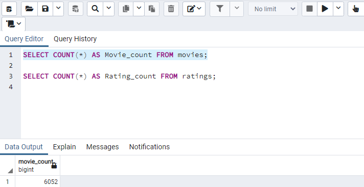
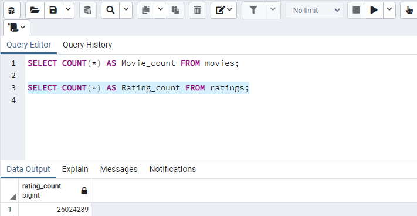

# Movie Database

## Overview:
### Extract, Transform, Load (ETL):
***Extracted*** Movies metadata, ratings, and other useful information from sources such as Kaggle and Wikipedia in various formats. Reviewed and analyzed the data to clean and ***Transform*** it into consistent and useful formats using lambda functions (within a function), list comprehension, regular expressions (regex) and various other string methods. ***Loaded*** the data into a PostgreSQL database for ease of access and use.

### Finished Products (record counts)

## Tools:
- Python including Pandas, NumPy, sqlalchemy, re (RegEx) libraries
- PostgreSQL

## Resources:
- wikipedia-movies.json (data compiled using https://en.wikipedia.org)
- movies_metadata.csv (https://www.kaggle.com/rounakbanik/the-movies-dataset/download)
- ratings.csv (https://www.kaggle.com/rounakbanik/the-movies-dataset/download)
 
